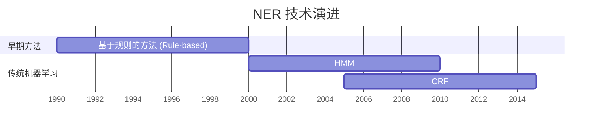

把内容整理成 Obsidian 风格的笔记。

## ⚙️ 配置加载

启动时 Read 本 skill 目录下的 `config.yaml` 获取环境配置：

```
~/.claude/skills/obs-note/config.yaml
```

配置项：
- `vault_root` — Vault 根目录的绝对路径
- `lang` — 笔记语言（`zh` = 中文为主附英文，`en` = English primary）

后续所有"Vault 根目录"均指 `vault_root` 的值。

---

## 📂 存储位置

> [!IMPORTANT]
> 所有笔记**必须直接保存到 Vault 根目录**，严禁创建任何子目录。
> 正确：`<vault_root>/AI_LongCat_大模型架构.md`
> 错误：`<vault_root>/AI/AI_LongCat_大模型架构.md`

---

## 📁 文件命名规范

必须遵循以下三段式结构，使用下划线 `_` 连接：

**格式**: `[分类/维度]_[主题关键词]_[补充说明/英文原文].md`

- **分类**: 笔记所属的领域（如 `AI`, `Tool`, `Location`, `Medical`, `Science`, `Security`, `Finance` 等）。
- **主题**: 笔记的核心名称（优先使用中文）。
- **说明**: 核心概念的英文、版本号或特定细节。

**示例**:
- `AI_LongCat-Video-Avatar_大模型架构.md`
- `Tool_MiniMind_全栈LLM从零训练.md`
- `Location_楚雄炼象关_Lianxiangguan.md`
- `Medical_司普奇拜单抗_Stapokibart.md`

## 笔记内容规范

### ⚠️ Frontmatter 格式（严禁代码块）

> [!CAUTION]
> Obsidian 的 YAML Frontmatter **必须使用三短横线 `---` 分隔符**，绝对不能使用代码块（` ``` `）包裹！
> Obsidian 的 YAML Frontmatter 最外层不需要 `property:` 属性，所有properties直接放在root层！

**✅ 正确格式**（Obsidian 可识别）：
```
```

**❌ 错误格式**（Obsidian 无法识别为 Property）：
```
```yaml
created: 2025-01-01
type: note
`` `
```

- **Properties 内容**: 包含全面且简练的要素：时间、人物、事件、观点、source、type、作者、alias（5个左右）。
- **语言**: 根据 `config.yaml` 中的 `lang` 决定。`zh` = 用中文整理，关键概念附上对应的英文。
- **可视化**: 必须在有必要时画 mermaid 图。
- **数学**: 数学公式使用单 `$` 或双 `$$` 包围。

## Mermaid 转义规范

> [!CAUTION]
> **括号 `()` 必须且仅在 Mermaid 图中转义！** 这是最常见的错误来源。
> - **Mermaid 内**: 必须转义（如 `#40;`, `#41;`），否则标签内的括号会破坏解析。
> - **转义仅限Mermaid图内**: 普通正文严禁转义！

> [!WARNING]
> ### AI 高频错误：正文转义污染
> AI 在写正文时会无意识地使用 Mermaid 转义符。**完成笔记正文后，必须执行以下自检**：
> 1. 扫描所有 `mermaid` 代码块**以外**的区域
> 2. 搜索是否存在 `#40;` 或 `#41;` 字符串（以及 `#lt;` `#gt;` 等）
> 3. 若发现，立即恢复为普通括号 `(`、`)` 等原始字符

### 转义规则的适用范围

**✅ 需要转义的位置** (仅限以下位置):
```markdown
` ``mermaid
graph TB
    Node["这里的括号需要转义 #40;like this#41;"]
` ``
```

**❌ 不需要转义的位置** (保持原样):
```markdown
# 标题中的括号 (不转义)
正文中的括号 (不转义)
- 列表项中的括号 (不转义)
> 引用块中的括号 (不转义)
```

### 常用转义对照表

> [!IMPORTANT]
> 此表 **仅适用于 Mermaid 代码块内的节点标签**,不适用于正文!

| 字符 | 转义码 | 说明 |
|------|--------|------|
| `(` | `#40;` | 最易遗漏 |
| `)` | `#41;` | 最易遗漏 |
| `"` | `#quot;` | 引号 |
| `#` | `#35;` | 井号 |
| `<` | `#lt;` | 小于号 |
| `>` | `#gt;` | 大于号 |
| 换行 | `<br>` | 强制换行 |
| `.`（数字后） | `#46;` | 有序列表陷阱：`1.` → `1#46;` |

> [!CAUTION]
> ### 有序列表陷阱：`1. text` 会触发解析错误
> Mermaid 会将节点标签内的 `数字. 文字` 识别为 Markdown 有序列表，抛出：
> `Unsupported markdown: list`
>
> **解决方案**（任选其一，优先用方案一）：
> 1. **转义句点**：`1#46; aaaa`、`2#46; bbbb`
> 2. **改用括号编号**：`1#41; aaaa`、`2#41; bbbb`（即 `1)` 样式）
> 3. **改用 Unicode 序号**：`① aaaa`、`② bbbb`

### 时间线

若需要展示技术演进或历史发展，使用 gantt 图。每个阶段用 `section` 划分，任务用 `任务名 :起始年, 结束年` 格式。



---

## 笔记类型扩展

若笔记为以下特定类型，Read 本 skill 目录下对应的类型规范文件，并遵循其中的额外要求：

| 笔记类型 | 判断条件 | 规范文件 |
|---|---|---|
| 地点 | `type: location` / 餐厅 / 景点 | `~/.claude/skills/obs-note/types/location.md` |
| 人物 | `#type/people` / `#function/biography` | `~/.claude/skills/obs-note/types/people.md` |

**普通笔记无需加载任何类型文件。**

---

## 🔄 Gleaning：多轮自查机制

> [!TIP]
> 受 LightRAG 增量提取 (Gleaning) 机制启发——LLM 在处理长内容时存在"注意力缺失"，单轮输出容易遗漏细节。
> **完成笔记初稿后**，必须进行以下两轮自查，就像 LightRAG 会用 `CONTINUE_PROMPT` 追问"还有遗漏吗？"一样。

### 第一轮：内容完整性检查

写完初稿后，逐项确认：
- 是否涵盖了用户提供的**所有关键信息**？
- Frontmatter 中的 `alias`、`tags`、`source` 是否完整？
- 有无遗漏重要的人物、事件、概念、时间节点？
- 如果内容涉及技术流程，是否已用 Mermaid 图可视化？

### 第二轮：格式合规性检查

- 正文中有无误用 `#40;` / `#41;`？（仅允许存在于 mermaid 块内）
- Mermaid 块内有无 `数字. 文字` 形式（如 `1. `、`2. `）？若有，必须改为 `1#46; ` 或 `①` 等替代写法。
- Frontmatter 是否使用 `---` 分隔符，而非代码块？
- 如为特定类型笔记（地点/人物），是否已加载并遵守对应 types/ 规范？

> [!NOTE]
> 执行第二轮时，可以问自己：**"这篇笔记还有什么遗漏或不规范的地方？"**
> 大多数情况下都能发现至少一处可以改进的细节。

---

## 🔗 PageIndex 关联发现

> [!INFO]
> 笔记写完并通过两轮自查后，使用 pageindex MCP 构建双向链接。若 MCP 不可用，跳过此整个章节，不降级处理。

### Step 1: 搜索关联笔记

从笔记标题、frontmatter tags 和正文前 3 个核心概念构建查询，并行调用 `find_notes`：

```
find_notes(query="<笔记主题核心词>", top_k=10)
```

**过滤**：从结果中移除当前笔记自身（按文件名 stem 匹配）。取前 **5 个**最相关结果存为 `RELATED_NOTES`。

若 `RELATED_NOTES` 为空，直接跳过后续步骤。

### Step 2: 更新当前笔记（向外链接）

将关联笔记写入当前笔记的 frontmatter `related-notes` 属性：

```yaml
related-notes:
  - "[[笔记A]]"
  - "[[笔记B]]"
  - "[[笔记C]]"
```

操作方式：用 Edit 找到 frontmatter 的结束符 `---`（第二个），在其前一行插入 `related-notes:` 列表。若 frontmatter 已有 `related-notes:` 字段则追加到该列表末尾。

### Step 3: 更新关联笔记（反向链接）

仅处理 `RELATED_NOTES` 中前 **3 个**笔记，避免过多写操作：

对每个关联笔记：
1. Read 读取完整文件
2. **若 frontmatter 已有 `related-notes:` 字段** → 用 Edit 在该列表末尾追加 `  - "[[当前笔记stem]]"`
3. **若 frontmatter 没有 `related-notes:` 字段** → 用 Edit 在 frontmatter 结束符 `---` 前插入：
   ```yaml
   related-notes:
     - "[[当前笔记stem]]"
   ```
4. **若文件没有 frontmatter** → 跳过，不处理

> [!CAUTION]
> 写入关联笔记时，`[[当前笔记stem]]` 只取文件名（不含路径和 `.md` 扩展名）。
> 确认关联笔记文件存在后再 Read，找不到的直接跳过。
